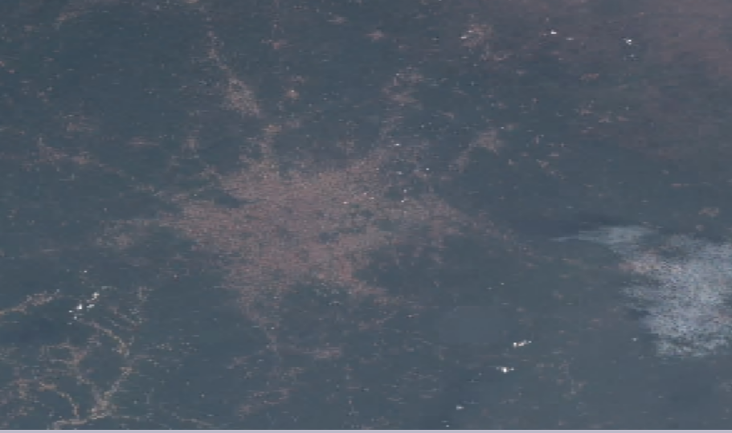
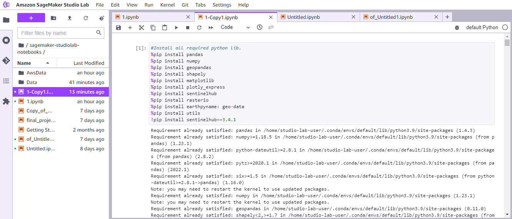
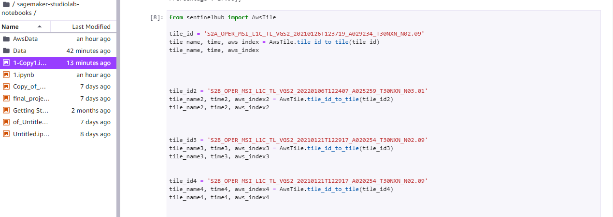
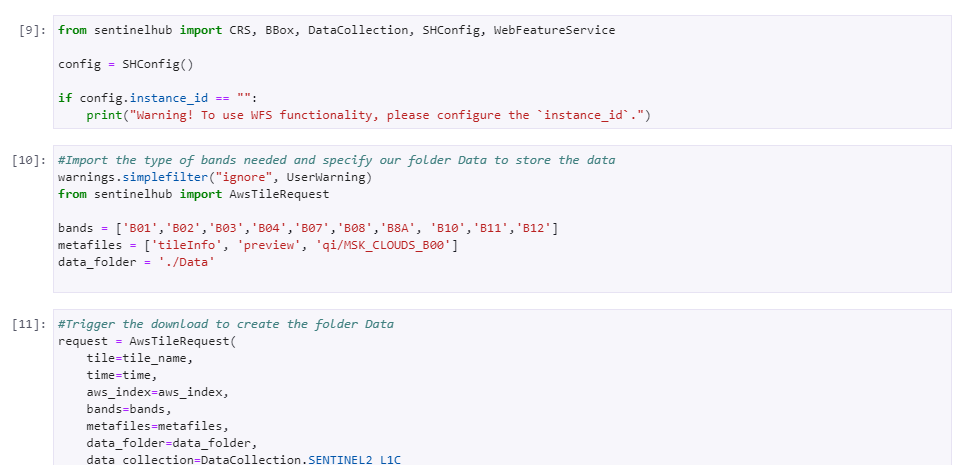
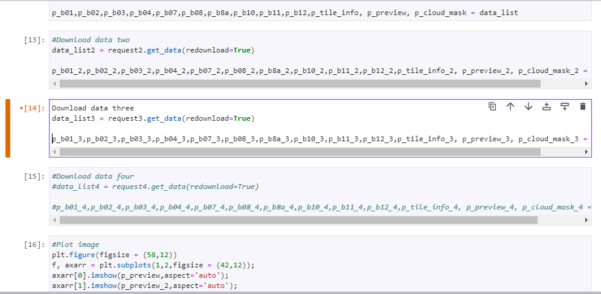
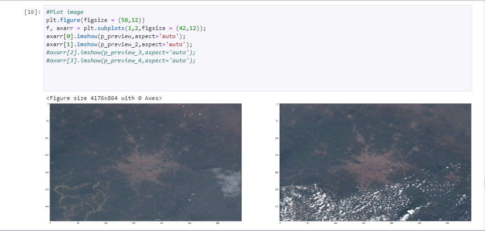
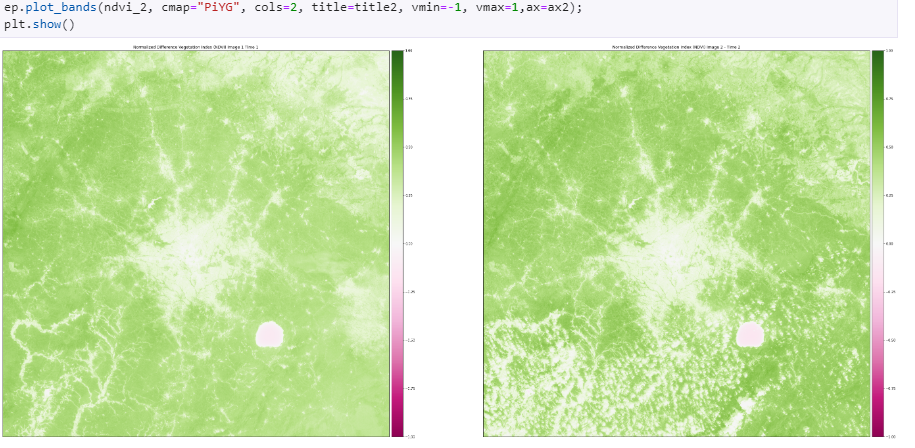

# ASDI-Hackathon: Deforestation Analysis

The `deforestation_asdi.ipynb` notebook is designed to analyze deforestation using high-resolution satellite imagery. The following steps outline our approach, utilizing tools like Sentinel-2 data and Python libraries for geospatial data analysis to track changes in forest cover over time.

---

### Steps Followed

#### 1. Download and Import Libraries
   - We start by importing essential libraries for geospatial and image processing tasks, including `matplotlib` and `rasterio`. These tools are critical for working with and visualizing satellite images.

#### 2. Obtain Coordinates
   - Using [BBox Finder](http://bboxfinder.com), we gather the bounding box coordinates (xMin, yMin, xMax, yMax) for **Mole National Park** and **Ankasa Game Reserves**. These coordinates define the areas we aim to analyze. We pass them to the `search_bbox` function to locate specific satellite imagery tiles.

#### 3. Determine Time Interval
   - The `search_time_interval` function allows us to specify a time frame, from a specific year range to recent months, giving us flexibility in analyzing changes over different periods.

#### 4. Extract Tile Information
   - Using the `wfs_iterator` function, we retrieve unique tile information for each area of interest. This function collects metadata such as tile IDs and dates for each relevant tile.

#### 5. Convert Tile IDs to Tile Names
   - Each tile ID is then converted to a tile name, which aligns with file names in the AWS S3 bucket, allowing us to retrieve specific images.

#### 6. Select Tiles with Minimal Cloud Cover
   - To ensure clear and reliable analysis, we choose tiles with the lowest cloud cover. High cloud cover obscures the land surface, making it difficult to analyze vegetation.

#### 7. Select Spectral Bands
   - We select specific Sentinel-2 spectral bands—`B01`, `B02`, `B03`, `B04`, `B07`, `B08`, `B8A`, `B10`, `B11`, and `B12`—to obtain the most useful data for vegetation analysis.

#### 8. Define Download Folders
   - Separate folders (`Mole_Data` and `Ankasa_Data`) are set up to store imagery for each park, keeping data organized.

#### 9. Request and Save Data
   - Using `request.save_data`, we send download requests for the chosen tiles, specifying the selected bands and folders for storage.

#### 10. Download Images
   - The download is triggered, retrieving images from the S3 bucket and saving them locally for further processing.

#### 11. Plot Images Using Matplotlib
   - We use `matplotlib` to visualize and inspect the satellite images, assessing the quality and coverage for each tile.

#### 12. Check for Deforestation Using Rasterio
   - Using `rasterio` and the GeoTIFF format, we analyze vegetation in the selected areas. Focusing on bands sensitive to vegetation (such as Band 4 for red and Band 8 for near-infrared), we can detect areas affected by deforestation.

#### 13. Plot the Final Image
   - Finally, we plot the processed images, providing a clear visualization of vegetation cover. This enables us to highlight deforestation trends and changes in forest density.

---

## Images and Code Snippets

Below are visualizations generated during our analysis, showing processed satellite images and vegetation changes over time.

---

This analysis offers insights into deforestation patterns, contributing valuable information to conservation efforts and enabling stakeholders to make data-driven decisions about protecting critical forest areas.
